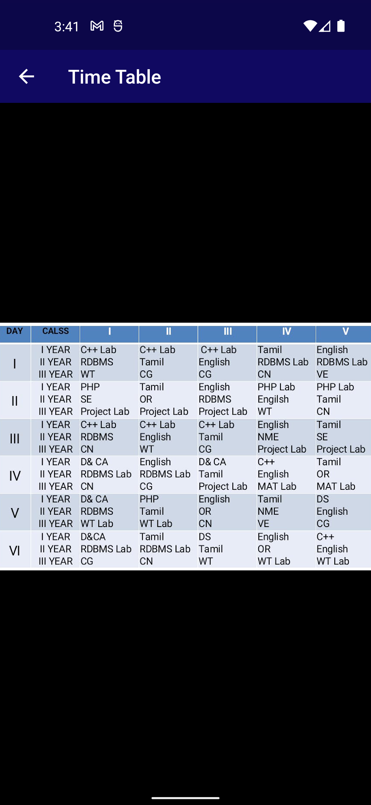

# Department App

Department App is a mobile application developed using Flutter framework that provides an interface for students and faculty members to access important information about their department.

## Features

The application offers the following features:

- **Faculty Member Detail:** Displays the details of all faculty members of the department such as name, designation, specialization and contact details.

- **Time Table:** Allows users to view the department's time table. The time table can be filtered by day and includes details such as the time, subject and teacher's name.

- **Student Detail:** Displays the details of all students enrolled in the department. Students can be searched by name, roll number and department.

- **Syllabus:** Displays the syllabus of all courses offered by the department. Users can view the syllabus of individual courses by selecting them from the list.

- **Events:** Shows a list of all the events that are organized by the department. Users can view the details of individual events by selecting them from the list.

- **About Department:** Displays information about the department such as its vision, mission, and history.

- **Result:** Displays the results of all the students enrolled in the department. Results can be searched by student's name and roll number.

## Getting Started

To get started with the application, follow these steps:

1. Clone this repository using `git clone https://github.com/your-username/department-app.git`.
2. Install Flutter and the necessary dependencies.
3. Run `flutter run` to launch the application on your local device.

## Screenshots

## Contributing

Contributions are always welcome! To contribute to the application, follow these steps:

1. Fork this repository.
2. Create a new branch with your changes using `git checkout -b my-feature`.
3. Make your changes and commit them using `git commit -am 'Add some feature'`.
4. Push your changes to your fork using `git push origin my-feature`.
5. Submit a pull request with your changes.

## Credits

This application was developed by [Your Name Here].

## License

This application is licensed under the [MIT License](https://opensource.org/licenses/MIT).
